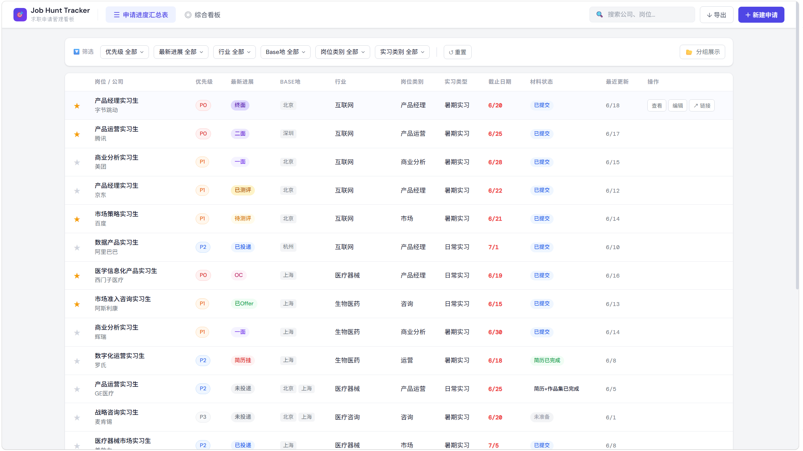
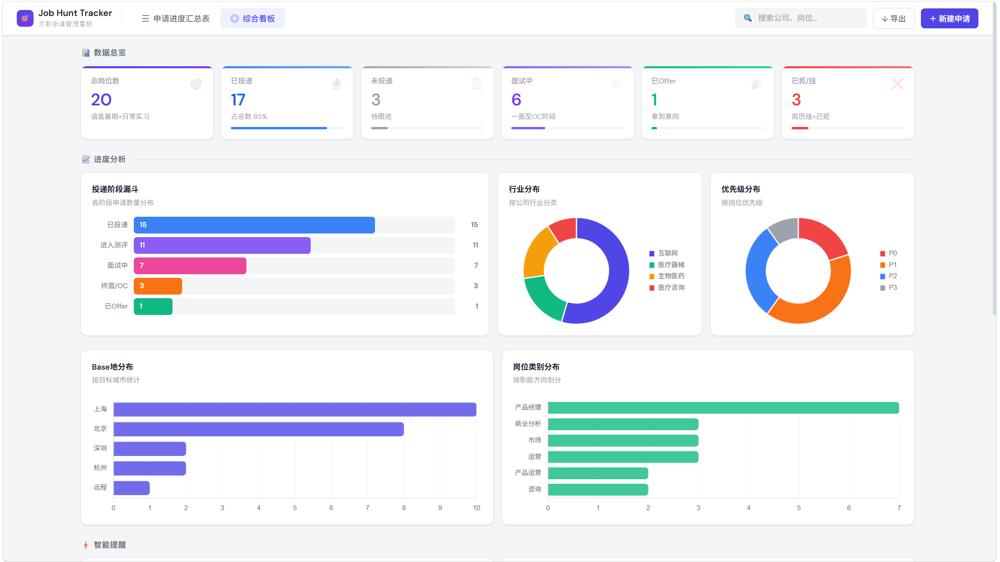

# Job Hunt Tracker｜求职申请管理看板

> 一个面向大学生 / 应届生求职场景的申请管理网页原型。  
> 通过 **岗位汇总表 + 综合看板** 两个核心模块，帮助用户统一记录岗位信息、跟踪申请进度，并通过可视化方式辅助求职决策。

## 在线预览

[点击查看项目演示](https://chengyuan03.github.io/job-hunt-tracker/)

---

## 项目预览

### 汇总表页面

### 综合看板页面

---

## 项目简介

在暑期实习、日常实习和校招过程中，求职者通常会同时申请多个岗位。岗位名称、公司信息、投递链接、测评安排、面试进展和结果反馈往往分散在不同平台里，导致记录成本高、跟进效率低，也很难从整体上判断自己的投递策略是否合理。

**Job Hunt Tracker** 希望解决的，不只是“把岗位记下来”，而是进一步帮助用户完成三件事：

- **统一记录**：把分散的岗位信息沉淀到结构化表格中
- **跟踪进度**：清楚知道每个岗位当前推进到哪一步
- **辅助决策**：通过看板快速识别重点岗位、投递结构和流程瓶颈

---

## 我的设计思路

这个项目不是一个单纯的数据展示页面，而是围绕“求职管理”这个真实场景，尝试把 **记录、分析、行动** 三件事连接起来。

我希望它不仅能回答“我投了什么”，还能够进一步回答：

- 我现在总共投了多少岗位？
- 哪些岗位已经进入面试流程？
- 哪些高优先级岗位还没处理？
- 我的投递方向是不是过于集中？
- 接下来最应该做的动作是什么？

因此，这个项目本质上是一个面向求职场景的轻量级管理与决策辅助工具原型。

---

## 用户画像

本项目主要面向以下用户：

- 正在申请 **暑期实习 / 日常实习 / 校招** 的大学生、研究生
- 同时申请多个岗位，需要统一管理投递进度的人
- 希望按 **优先级、城市、行业、岗位类别** 对申请进行整理的人
- 容易在多个招聘平台之间来回切换，希望减少混乱和遗漏的人

---

## 用户需求与痛点

### 用户需求
用户需要一个系统，能够：

- 集中记录岗位信息
- 标记岗位优先级和申请阶段
- 追踪不同公司的流程进展
- 快速筛选值得重点关注的岗位
- 从整体上查看当前投递情况和阶段分布
- 更高效地安排下一步行动

### 核心痛点

#### 1. 信息分散
岗位信息散落在官网、招聘平台、飞书表格、聊天记录和备忘录中，不便统一维护。

#### 2. 进度混乱
“未投递 / 已投递 / 待测评 / 已测评 / 一面 / 二面 / Offer / 已拒”等状态容易混淆。

#### 3. 缺少整体视角
即使能记录单条岗位，也很难快速看清：
- 当前总申请数
- 面试推进情况
- 高优先级岗位处理情况
- 投递方向是否过于集中

#### 4. 行动决策成本高
用户需要不断判断：
- 今天先投哪个岗位？
- 哪些岗位该优先跟进？
- 哪些岗位已经可以结束投入？

---

## 产品结构

本项目采用双模块结构：

### 1. 求职申请进度汇总表
负责岗位申请信息的录入、查看、筛选和状态维护。

### 2. 综合看板
负责对汇总表中的数据进行统计分析与可视化呈现。

整体逻辑很明确：

- **汇总表** 解决“记录和管理”
- **看板** 解决“总结和分析”

---

## 功能设计

## 1. 求职申请进度汇总表

这是整个产品的主操作区域，用来维护岗位申请的核心信息。

### 字段设计

当前支持以下字段：

- 岗位名称
- 优先级（P0 / P1 / P2 / P3）
- 公司名称
- 最新进展  
  （未投递、已投递、待测评、已测评、简历挂、一面、二面、终面、OC、已 Offer、已拒、流程结束）
- Base 地（支持多选）
- 公司类别 / 行业（支持多选）
- 岗位类别
- 是否转正（日常实习、暑期实习、未知）
- Link
- 备注

### 核心能力

- 集中展示所有岗位记录
- 通过标签区分优先级与状态
- 支持分组查看和多维筛选
- 帮助用户快速识别当前最需要处理的岗位

### 设计重点

- 用结构化表格承载高密度信息
- 用颜色标签降低状态识别成本
- 尽量贴近飞书 / Airtable 类工具的使用习惯

---

## 2. 综合看板

这是本项目的分析页，用于帮助用户从全局视角理解自己的求职进展。

### 看板核心内容

- 总岗位数
- 已投递岗位数
- 未投递岗位数
- 面试中岗位数
- Offer / 拒绝 / 流程结束数量
- 不同阶段的申请分布
- 行业分布
- Base 地分布
- 岗位类别分布
- 高优先级岗位推进情况

### 设计目标

帮助用户快速回答这些问题：

- 我现在总共申请了多少岗位？
- 已推进到面试阶段的有多少？
- 哪些岗位还没有处理？
- 我的投递集中在哪些行业 / 城市 / 岗位方向？
- 当前最值得继续跟进的是什么？

---

## 核心亮点

### 1. 表格 + 看板双视角
不仅能记录细节，也能快速查看整体进展。

### 2. 贴近真实求职场景
字段、状态和模块设计都来自真实的岗位申请管理需求。

### 3. 结构化状态管理
把求职流程拆成明确阶段，帮助用户降低混乱感。

### 4. 可视化辅助决策
让静态记录进一步变成可分析、可复盘、可行动的信息。

---

## 适用场景

- 暑期实习投递管理
- 日常实习申请跟踪
- 秋招 / 春招岗位进度管理
- 多行业 / 多城市 / 多岗位方向的对比与复盘
- 面试阶段的集中跟进

---

## 项目价值

相较于一个单纯的岗位记录表，本项目更强调三件事：

- **结构化管理**
- **可视化复盘**
- **面向行动的进度追踪**

它尝试把求职过程从“零散记录”升级为“有节奏的流程管理”。

---

## 后续可迭代方向

未来可以继续扩展：

- 截止日期提醒
- 面试 / 测评日历视图
- 自动生成求职周报
- AI 智能建议与风险提示
- 本地存储 / 数据导入导出
- 移动端适配
- 深色模式

---

## 项目说明

当前版本为前端静态网页原型，重点展示：

- 产品结构设计
- 信息架构与字段设计
- 求职管理场景下的功能抽象
- 数据可视化与看板思路

适用于产品设计展示、作品集呈现和 AI 编程考察场景。

---

## 在线访问

[https://chengyuan03.github.io/job-hunt-tracker/](https://chengyuan03.github.io/job-hunt-tracker/)
